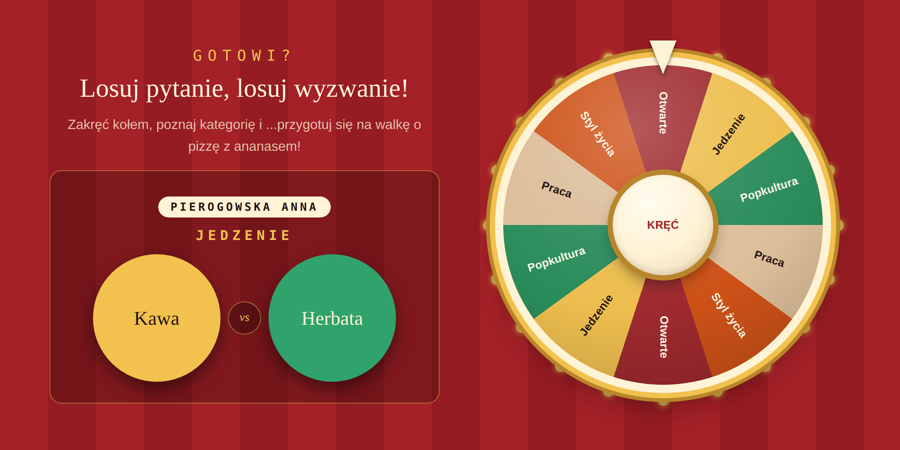

# Koło Fortuny

Gra na spotkanie zespołu. Koło losuje **kategorię**, z kategorii leci **pytanie „A czy B”**, a jeśli wybrałaś uczestników — także **osoba, która odpowiada**.



## Ekrany

| Ekran | Rola |
|---|---|
| `Wybory` | Ekran główny: koło, przycisk **Zakręć** w piaście, karta z wylosowanym pytaniem, licznik zużycia puli. |
| `WyborOsob` | Dwa kafle obok siebie: pula osób z SharePointa po lewej, gracze na dziś po prawej. Kliknięcie przenosi osobę między nimi. |
| `DodajPytanie` | Formularz dorzucania własnych pytań do puli, z podglądem tego, co już w kategorii jest, i blokadą duplikatów. |

## Listy SharePoint

**`Pytania Koło Fortuny`** — pula pytań:

| Kolumna | Zawartość |
|---|---|
| `Title` | Kategoria: `Jedzenie`, `Popkultura`, `Praca`, `Styl życia`, `Otwarte` |
| `Intro` | Opcjonalny wstęp wyświetlany kursywą nad opcjami |
| `OpcjaA` | Pierwsza opcja, a w kategorii `Otwarte` — całe pytanie |
| `OpcjaB` | Druga opcja; pusta w kategorii `Otwarte` |

**`Team Members`** — pula osób, jedna kolumna `Title` z imieniem i nazwiskiem.

Gotowe pliki do importu leżą w [`sharepoint/`](sharepoint/). `ID` nadaje SharePoint, w plikach go nie ma.

**Dane przykładowe są zmyślone.** Nazwiska w `Team_Members.xlsx` nie należą do żadnych prawdziwych osób — repozytorium jest publiczne, więc podmień je na własne dopiero na swoim SharePoincie. Pytania w `Pytania_Kolo_Fortuny.xlsx` to 72 pozycje w pięciu kategoriach: część własna, część zainspirowana typowymi listami icebreakerów („latanie czy niewidzialność", „tylko szeptać czy tylko krzyczeć", „cztery dni po dziesięć godzin czy pięć po osiem").

## Dźwięk

Ekran `Wybory` odwołuje się do zasobu `Spin1` — dźwięku kręcącego się koła, startującego i gasnącego razem z animacją. Plik i instrukcja podpięcia leżą w [`media/`](media/), bo Power Apps nie eksportuje zasobów Media przez schowek YAML.

## Koło jest z CSS, nie z SVG

`HtmlViewer` wycina `<svg>` w całości — bez błędu, po prostu nic nie widać. Koło jest więc złożone z tego, co kontrolka przepuszcza:

- **tarcza** to `conic-gradient` sklejany `Concat` z kolekcji `colKolo`, po 36° na segment;
- **obrót** to `transform: rotate()` na kącie liczonym w Power Fx;
- **żarówki** na obwodzie to 20 pozycjonowanych absolutnie kółek z gotowymi wartościami sinusa i cosinusa w `colZarowki` (Power Fx ma `Sin`/`Cos`, ale liczenie ich w każdym przeliczeniu formuły to strata, więc leżą jako stałe);
- **pulsowanie żarówek** to `@keyframes` w bloku `<style>`, przełączane w zależności od tego, czy koło się kręci, czy właśnie stanęło na wyniku;
- **wskaźnik** u góry to trójkąt z `border-*: solid transparent`.

Rozmiary są liczone z `Self.Width`, więc koło skaluje się razem z kontrolką.

## Jak działa zatrzymanie na właściwym segmencie

Segment losuje się **przed** animacją, a nie po niej:

```
Set(gblIdx, RandBetween(1, CountRows(colKolo)));
Set(gblKat0, Mod(gblKat, 360));
Set(gblKatCel, gblKat0 + 1440 + Mod(360 - (gblIdx - 0.5) * (360 / CountRows(colKolo)) - gblKat0, 360));
```

`1440` to cztery pełne obroty dla efektu, a `Mod(...)` dolicza dokładnie tyle, żeby środek wylosowanego segmentu wylądował pod wskaźnikiem. Kąt w trakcie kręcenia interpoluje się z `SpinTimer.Value / SpinTimer.Duration` przez funkcję łagodzącą `1 - (1-t)²`, więc koło zwalnia przed zatrzymaniem.

## Dlaczego `Kat` powtarza się w drugiej połowie koła

Kolekcja `colKolo` trzyma dla każdego segmentu gotowe `Sx`, `Cy` (pozycja etykiety, sinus i cosinus kąta środkowego) oraz `Kat` — obrót samego napisu. Wartości `Kat` powtarzają się w obu połowach koła (`-72, -36, 0, 36, 72` dla segmentów 1–5 i identycznie dla 6–10), i to jest celowe.

Gdyby `Kat` rósł dalej (`108, 144, 180, 216, 252`), napisy w dolnej połowie stanęłyby **do góry nogami** — obrót powyżej 90° odwraca tekst. Odjęcie 180° obraca sam napis, nie ruszając jego położenia, bo pozycję wyznaczają niezależne `Sx` i `Cy`. Efekt: wszystkie etykiety są czytelne bez przekręcania głowy.

## Blokada powtórek

**Pytania** — kolekcja `colWidziane` trzyma wszystko, co już padło. Gdy w danej kategorii skończą się nieużyte pytania, `RemoveIf(colWidziane, Temat = gblTemat)` czyści tylko tę jedną kategorię.

**Osoby** — zmienna `gblPowtorka` liczy, ile razy z rzędu wypadła ta sama osoba. Przy drugim powtórzeniu ta osoba wypada z puli na jedno losowanie:

```
With({pula: If(gblPowtorka >= 2 && CountRows(colGracze) > 1,
               Filter(colGracze As o, o.Imie <> gblOsoba), colGracze)},
     Set(gblNowa, First(Shuffle(pula)).Imie));
Set(gblPowtorka, If(gblNowa = gblOsoba, gblPowtorka + 1, 1));
Set(gblOsoba, gblNowa)
```

To celowo **nie** jest sztywna rotacja. Wcześniejsza wersja wykluczała połowę stawki i przy małej grupie robiła się przewidywalna karuzela. Teraz los jest prawdziwy, a jedyne ograniczenie to trzeci raz pod rząd.

## Odświeżanie listy osób

`colOsoby` ładuje się w `App.OnStart`, czyli raz na uruchomienie aplikacji. Gdyby ktoś dopisał osobę do SharePointa przy otwartej aplikacji, nie byłoby jej widać — dlatego ekran `WyborOsob` przeładowuje kolekcję we własnym `OnVisible`. Kosztuje to jedno zapytanie przy wejściu na ekran; `colGracze` zostaje nietknięte.
